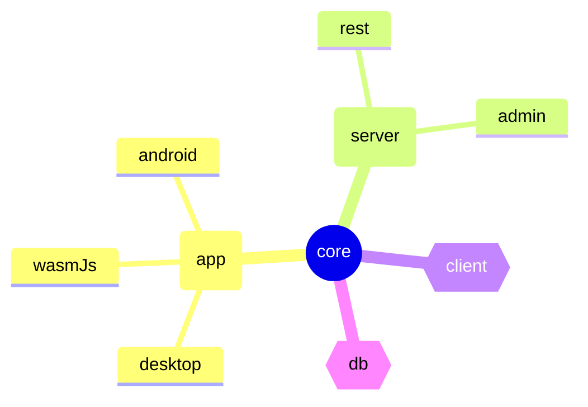

# Ktor Chat

A full-stack example application using:
- Ktor Server / Client
- Compose Multi-platform
- Exposed 

The features presented in the application include:
- Real-time messaging
- Chat room management
- Authentication and user management

## Project Structure

The project consists of the following modules:

| module                           | description                                                  |
|----------------------------------|--------------------------------------------------------------|
| [core](core)                     | domain data objects, interfaces, and exceptions              |
| [server / common](server/common) | common server functionality                                  |
| [server / rest](server/rest)     | ktor server REST implementation                              |
| [server / admin](server/admin)   | admin service for making sensitive changes                   |
| [app / common](app/common)       | shared front-end application code                            |
| [app / android](app/android)     | android front-end application                                |
| [app / desktop](app/desktop)     | jvm desktop front-end application                            |
| [app / wasmJs](app/wasmJs)     | wasm-js web front-end application                            |
| [db](db)                         | exposed database schema types and repository implementations |
| [client](client)                 | common client library for interacting with the back-end      |

Below is a diagram of how the modules depend on one another:



This structure illustrates an [inversion of control](https://en.wikipedia.org/wiki/Inversion_of_control) 
for a full-stack Kotlin application, with a nod to architectures like _Onion_, _Hexagonal_, or _Clean_.

## Running

There are multiple chat client implementations under `./app/*` that can be executed independently 
with a mock environment, or with a server running.

### Running on Android

To run the android client you should specify the valid server url in the [ChatViewModelProvider.kt](app/common/src/androidMain/kotlin/vm/ChatViewModelProvider.kt).
Remember: The emulator has its own `localhost`. You can check your local ip using `ifconfig | grep "inet "`.

Here is a list of the commands for running each program:

| application | main source                       | gradle command                  |
|-------------|-----------------------------------|---------------------------------|
| server-rest | `server/rest/src/main/kotlin/Rest.kt`  | `./gradlew :server:rest:run`    |
| desktop app | `app/desktop/src/main/kotlin/main.kt`         | `./gradlew :app:desktop:jvmRun` |
| android app | `app/android/src/androidMain/kotlin/MainActivity.kt` |                                 |
| wasmJs app | `app/wasmJs/src/wasmJsMain/kotlin/io.ktor.chat/main.kt` | `./gradlew :app:wasmJs:wasmJsBrowserRun` |

### With Docker

If you'd like to run everything in a containerized environment:

First, publish images locally using:
- `./gradlew :server:rest:publishImageToLocalRegistry`
- `./gradlew :server:admin:publishImageToLocalRegistry`

Now, you can run docker compose:
```bash
docker compose up
```

## Screenshots


