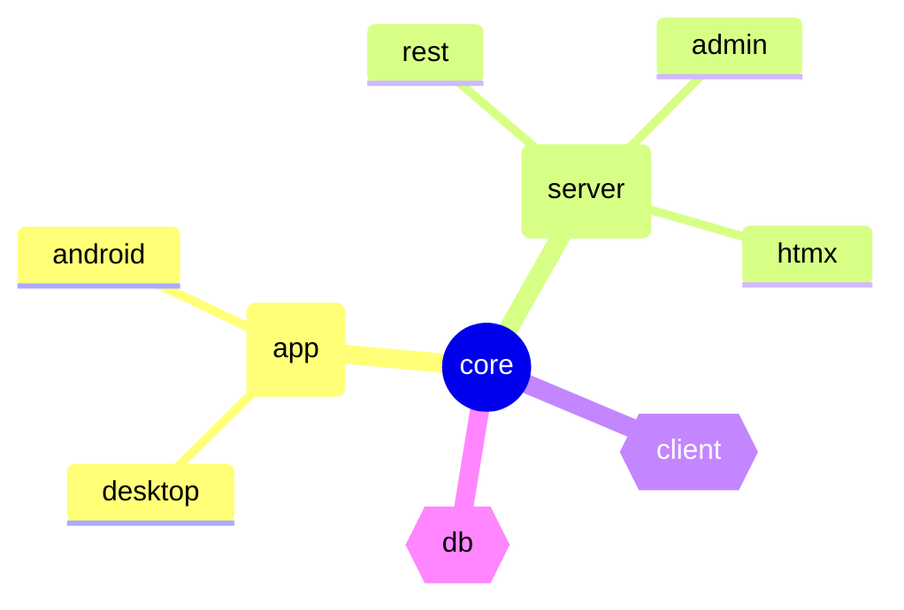

# Ktor Chat

A full-stack example application using:

- Ktor Server / Client
- Compose Multi-platform
- Exposed

The features presented in the application include:

- Real-time messaging
- Chat room management
- Authentication and user management

## Project Structure

The project consists of the following amper modules:

| module                           | description                                                  |
|----------------------------------|--------------------------------------------------------------|
| [core](core)                     | domain data objects, interfaces, and exceptions              |
| [server / common](server/common) | common server functionality                                  |
| [server / rest](server/rest)     | ktor server REST implementation                              |
| [server / admin](server/admin)   | admin service for making sensitive changes                   |
| [app / common](app/common)       | shared front-end application code                            |
| [app / android](app/android)     | android front-end application                                |
| [app / desktop](app/desktop)     | jvm desktop front-end application                            |
| [db](db)                         | exposed database schema types and repository implementations |
| [client](client)                 | common client library for interacting with the back-end      |

Below is a diagram of how the modules depend on one another:



This structure illustrates an [inversion of control](https://en.wikipedia.org/wiki/Inversion_of_control)
for a full-stack Kotlin application, with a nod to architectures like _Onion_, _Hexagonal_, or _Clean_.

## Configuration

This project uses **BuildKonfig** to manage configuration values. Before running the application, you need to update the BuildKonfig configuration according to your setup and generate the configuration files:

```bash
./gradlew generateBuildKonfig
```

## Running

There are multiple chat client implementations under `./app/*` that can be executed independently
with a mock environment, or with a server running.

Here is a list of the commands for running each program:

| application | main source                       | gradle command                  |
|-------------|-----------------------------------|---------------------------------|
| server-rest | `server/rest/src/Application.kt`  | `./gradlew :server:rest:run`    |
| desktop app | `app/desktop/src/main.kt`         | `./gradlew :app:desktop:jvmRun` |
| android app | `app/android/src/MainActivity.kt` |                                 |

### With Docker

If you'd like to run everything in a containerized environment:

First, publish images locally using:

- `./gradlew :server:rest:publishImageToLocalRegistry`
- `./gradlew :server:admin:publishImageToLocalRegistry`

Now, you can run docker compose:

```bash
docker compose up
```

## Running the iOS Application

### Prerequisites
To run the iOS frontend application:
1. Import the project in IntelliJ IDEA
    - Open the project root directory in IntelliJ IDEA

### Setup iOS Subproject
If you encounter problems importing the project or need to manually initialize the iOS subproject, run these commands:
``` bash
./gradlew generateDummyFramework
cd iosApp
# you should have cocoapods installed
pod install
```

### Running in iOS Simulator
To run the application in the iOS simulator:
1. Open in Xcode `/iosApp/iosApp.xcworkspace`
2. Select your target device/simulator
3. Build and run the project

**Note**: Make sure to open the `.xcworkspace` file (not the `.xcodeproj` file) as it includes the CocoaPods dependencies.

## Building the Project
**Memory Optimization**: Running `./gradlew build` can consume excessive memory, especially when linking iOS frameworks. It's recommended to build each platform separately to avoid memory issues:
``` bash
# Build specific iOS targets individually
./gradlew :app:common:iosArm64MainKlibrary
./gradlew :app:common:iosSimulatorArm64MainKlibrary

# Or build other platforms separately
./gradlew :app:android:build
```


## Screenshots


